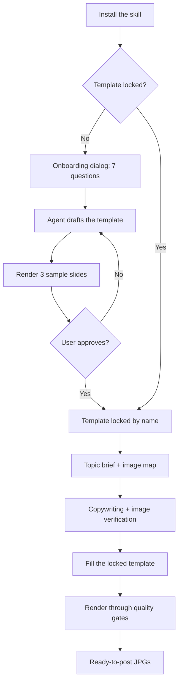

<div align="center">

# Carouso

**An AI agent skill for scroll-stopping carousel posts.**

Turn a topic into a designed, ready-to-post carousel for Instagram, TikTok, or Facebook.
One locked template. Zero design drift. Real images only. No AI slop.


*Five slides, one locked template. Slide 3 shows the empty image slot where user uploads land.*

</div>

---

## Why Carouso

| | |
|---|---|
| **Template-first** | Design the system once with the user, then every carousel inherits it. Layouts never drift. |
| **Guided onboarding** | A 7-question dialog (style, colors, type feel, brand, topic, language, template name) locks the brand before any pixel is placed. |
| **Real images only** | Images come from user uploads or URLs. Every image passes visual verification. Generative AI imagery is banned, no exceptions. |
| **Quality gates** | The render fails on wrong slide count, overflowing content, wrong dimensions, or an unloaded webfont. Defects never ship silently. |

## How it works



**Phase 1 — lock a template (once per brand).** Answer 7 quick questions, or send a screenshot or HTML file you like as reference. The agent drafts the template, renders samples, and iterates with you until you approve it. Name it (for example `morningcup-playful`) and it becomes the design system for everything after. Create more named templates anytime and pick one per carousel.

**Phase 2 — produce carousels.** For each new topic the agent writes the copy, verifies and places your images on the slides you choose, and renders print-clean JPGs. The layout never drifts, because every carousel starts from your locked template.

## The onboarding dialog

| # | Question | Choices |
|---|---|---|
| 1 | What vibe should the carousel have? | Playful and friendly / Clean and minimal / Bold and striking / Warm and elegant / Dark and premium |
| 2 | Pick a color mood. | Warm earth / Fresh natural / Ocean calm / Bold contrast / Soft pastel |
| 3 | Pick a type feel. | Rounded and playful / Elegant serif / Bold and modern / Clean and simple |
| 4 | Brand name and handle for the watermark? | Free text |
| 5 | What are the carousels usually about? | Free text |
| 6 | Indonesian or English? | Two choices |
| 7 | What should we call this template? | Free text |

Font choices stay at the feel level. The agent maps them to real fonts internally. No font names, no jargon.

## Design standards

Every slide is held to the same bar:

- **Hierarchy.** The headline is the largest, boldest element. One accent-colored word per headline.
- **Contrast.** Text over photos sits on a scrim or card. Never on a busy photo directly.
- **Typography.** Two font families maximum. Every font must load, or the render fails.
- **Color.** 60 percent base, 30 percent secondary, 10 percent accent.
- **Copy.** Short declarative sentences. Concrete nouns and strong verbs. No AI tells: no em dashes, no "delve", no "unlock", no filler openers.
- **Consistency.** Topbar, footer, cards, radius, and shadows never change across slides.

## Quick start

1. Copy the `carouso/` folder into your agent's skills directory (`~/.claude/skills/`, `~/workspace/skills/`, or your platform's skills folder).
2. Trigger the skill. If no template is locked yet, the onboarding dialog opens.
3. Approve the rendered samples. Your template is locked.
4. Send a topic brief. Get back rendered JPGs.

## Package contents

```
carouso/
├── SKILL.md                  ← the whole skill: workflow, design thinking, gates
├── assets/
│   ├── base-template.html    ← starting scaffold for phase 1
│   └── preview-all.jpg       ← all five sample slides in one strip
├── scripts/
│   └── render_carousel.py    ← Playwright render with quality gates
└── examples/
    └── brief-example.md      ← a complete brief and how the skill handles it
```

No references folder. Everything the agent needs lives in `SKILL.md`.

## Render requirements

- Python 3 plus `playwright` (`pip install playwright && playwright install chromium`)
- The display and body fonts installed on the system (check: `fc-list | grep -i "<font-name>"`)

## Rules the skill never breaks

1. No template, no production.
2. Images from uploads or URLs only. No generative AI imagery.
3. Every image is visually verified before use.
4. A failed quality gate means fix the HTML, never bypass the gate.
5. No per-carousel redesigns. Template changes go through Phase 1.
