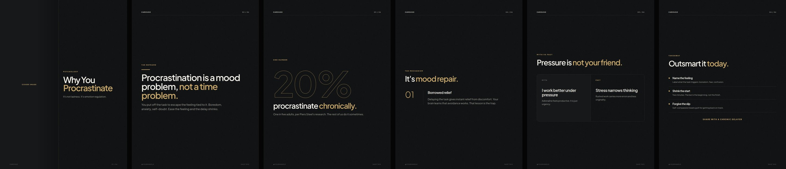
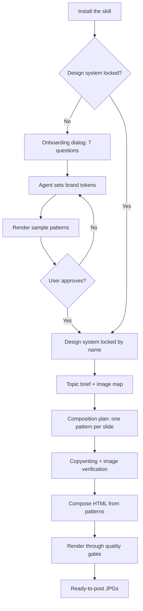

<div align="center">

# Carouso

**An AI agent skill for scroll-stopping carousel posts.**

Turn a topic into a designed, ready-to-post carousel for Instagram, TikTok, or Facebook.
One locked design system. Every carousel composed fresh. Real images only. No AI slop.



*Six slides, six different patterns, one brand. Tokens stay locked. Composition stays free.*

</div>

---

## Why Carouso

| | |
|---|---|
| **Design system, not a template** | Brand tokens (colors, fonts, spacing) stay locked. Layouts are composed per topic from a 12-pattern library. Consistent, never templated. |
| **Guided onboarding** | A 7-question dialog (style, colors, type feel, brand, topic, language, system name) locks the brand before any pixel is placed. |
| **Real images only** | Images come from user uploads or URLs. Every image passes visual verification. Generative AI imagery is banned, no exceptions. |
| **Quality gates** | The render fails on wrong slide count, overflowing content, wrong dimensions, or an unloaded webfont. Defects never ship silently. |

## How it works



**Phase 1 — lock a design system.** Answer 7 quick questions, or send a screenshot or HTML file you like as reference. The agent sets your brand tokens, renders sample patterns in them, and iterates with you until you approve. Name it (for example `morningcup-playful`). Build more named systems anytime and pick one per carousel.

**Phase 2 — compose carousels.** For each new topic the agent plans a composition (one pattern per slide, never repeating the previous carousel's cover), writes the copy, verifies and places your images, and renders print-clean JPGs. Variety is enforced by hard rules, not left to chance.

## The onboarding dialog

| # | Question | Choices |
|---|---|---|
| 1 | What vibe should the carousel have? | Playful and friendly / Clean and minimal / Bold and striking / Warm and elegant / Dark and premium |
| 2 | Pick a color mood. | Warm earth / Fresh natural / Ocean calm / Bold contrast / Soft pastel |
| 3 | Pick a type feel. | Rounded and playful / Elegant serif / Bold and modern / Clean and simple |
| 4 | Brand name and handle for the watermark? | Free text |
| 5 | What are the carousels usually about? | Free text |
| 6 | Indonesian or English? | Two choices |
| 7 | What should we call this design system? | Free text |

Font choices stay at the feel level. The agent maps them to real fonts internally. No font names, no jargon.

## The pattern library

Twelve structural patterns in `design-system/`, all token-driven:

| Pattern | Use for |
|---|---|
| cover-big-type, cover-split | Opening hooks |
| kicker-statement | Editorial openers, strong claims |
| stat-band, big-number | Numbers and research |
| concept-number | One big idea per slide |
| quote | A line worth remembering |
| two-cards | Paired ideas, do vs don't |
| image-hero | A photo that carries the slide |
| process-steps | Sequences and how-tos |
| myth-fact | Correcting a misconception |
| takeaway | Closers, recaps, CTAs |

## Design standards

Every slide is held to the same bar:

- **Hierarchy.** The headline is the largest, boldest element. One accent-colored word per headline.
- **Contrast.** Text over photos sits on a scrim or card. Never on a busy photo directly.
- **Typography.** Two font families maximum. Every font must load, or the render fails.
- **Color.** 60 percent base, 30 percent secondary, 10 percent accent.
- **Copy.** Short declarative sentences. Concrete nouns and strong verbs. No AI tells: no em dashes, no "delve", no "unlock", no filler openers.
- **Consistency.** Tokens never change across slides. Patterns vary. That is the whole trick.

## Quick start

1. Copy the `carouso/` folder into your agent's skills directory (`~/.claude/skills/`, `~/workspace/skills/`, or your platform's skills folder).
2. Trigger the skill. If no design system is locked yet, the onboarding dialog opens.
3. Approve the rendered samples. Your design system is locked.
4. Send a topic brief. Get back rendered JPGs.

## Package contents

```
carouso/
├── SKILL.md                  ← the whole skill: workflow, design thinking, gates
├── design-system/
│   ├── system.css            ← brand tokens + all 12 pattern styles
│   ├── patterns.html         ← the 12 patterns as full slides
│   └── PATTERNS.md           ← catalog: what each pattern is for
├── assets/
│   └── preview-all.jpg       ← six demo slides in one strip
├── scripts/
│   └── render_carousel.py    ← Playwright render with quality gates
└── examples/
    └── brief-example.md      ← a complete brief and how the skill handles it
```

No references folder. Everything the agent needs lives in `SKILL.md`.

## Render requirements

- Python 3 plus `playwright` (`pip install playwright && playwright install chromium`)
- The display and body fonts installed on the system (check: `fc-list | grep -i "<font-name>"`)

## Rules the skill never breaks

1. No design system, no production.
2. Compose from the pattern library. No per-carousel layout inventions.
3. Variety rules are hard rules: no adjacent duplicate patterns, no repeated cover in a row.
4. Images from uploads or URLs only. No generative AI imagery.
5. Every image is visually verified before use.
6. A failed quality gate means fix the HTML, never bypass the gate.
